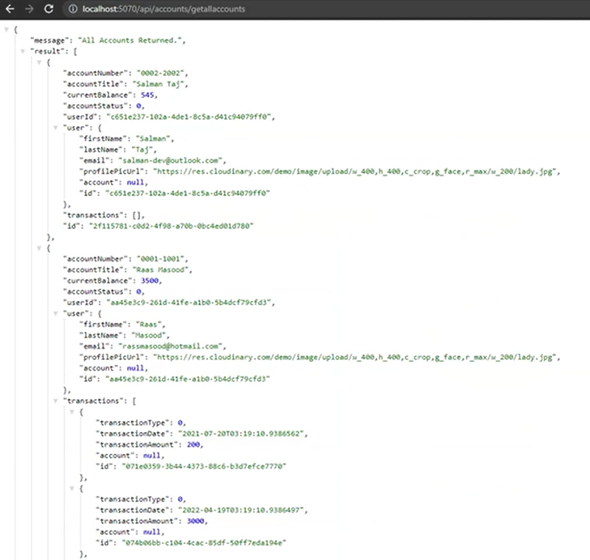

# Angular Resolver Design Pattern

Developing a real-world application with multiple calls to the server can be full of bugs. These delays *may cause a negative impact on the user interface*. Today, we are going to understand Route Resolvers in Angular. 

## What is a Resolver Design Pattern in Angular?

A Resolver is a class that **implements the Resolve interface** of Angular Router. A Resolver **acts like middleware**, which can be **executed before a component is loaded** and Resolver class will **fetch your data before the component is ready**. It has to be provided in the root module.  

---------------

## About this Exercise

In this lab we will be working on the **Frontend Code Base** only. We will only call Accounts APIs from the previously designed labs.

### **Backend Code Base:**

Previously, we have developed Accounts API which is **GetAllAccounts**. We will call the followings API to get all accounts. We will call the following API to get all accounts which will return the result in a JSON format as in the image given below

http://localhost:5070/api/Accounts/GetAllAccounts


There are 4 Projects in the solution. 

*	**Entities**: This project contains DB models like User where each User has one Account and each Account can have one or many Transactions. There is also a Response Model of LineGraphData that will be returned as API Response. 

*	**Infrastructure**: This project contains BBBankContext that service as fake DBContext that populates one User with its corresponding Account that has three Transactions dated of last three months with hardcoded data. 

* **Services**: This project contains AccountsService 

* **BBBankAPI**: This project contains AccountsController with a GET method  **GetAllAccounts** to call the AccountsService.


For more details about this base project visit: https://github.com/PatternsTechGit/PT_ServiceOrientedArchitecture

-----------

### **Frontend Code Base:**

Previously, we scaffolded a new Angular application in which we have 

* FontAwesome library for icons
* Bootstrap library for styling 
* Bootstrap navbar implemented


_____________

## In this Exercise

* We will create client side models to receive data from our BBBankAPI response
* We will create accounts service to call the BBBankAPI
* We will be implementing resolver pattern to resolve the data for the route 
* We will populate the Html table using the response from the BBBankAPI

### **Step 1: Creating Client Side Interfaces**

We will create two interfaces for **Account** and **User** to receive data, as given below

***Account Interface***
```ts
import { User } from "./user";

export interface Account {

    accountTitle: string;
    user: User;
    currentBalance: number;
    accountStatus: number;
}
```
***User Interface***
```ts
export interface User {
    profilePicUrl: string;
}
```

----------------

### **Step 2: Set API Url Base in Environment Variable**


To set this up

* Copy the `base URL` from our BBBankAPI project
* Create a variable `apiUrlBase` in our environment script file
* Assign this URL to the variable as show below

```ts
export const environment = {
  apiUrlBase: 'http://localhost:5070/api/',
  redirectUri: 'http://localhost:4200', 
};


export default environment;
```
-------------------

 ### **Step 3: Create an Accounts Service**

 To create an account service we can follow these steps:
 * First import HttpClientModule in *module.ts* file

 ```ts
 import { HttpClientModule } from '@angular/common/http';

 imports: [
    HttpClientModule 
  ]
 ```

  * Now we will create service named `account` from terminal using this command

  ```bash
  ng generate service account
  ```

  In this service we will first import `HttpClient`, `Account Model`, `Observable`, and `environment` file we just created we have created and will implement `getAllAccounts` method which will return an array of accounts in response of observable type.
  
  ```ts
import { Injectable } from '@angular/core';
import { HttpClient } from '@angular/common/http';
import { Observable } from 'rxjs';
import { environment } from 'src/environments/environment';
import { Account } from '../models/account';


@Injectable({
  providedIn: 'root',
})
export default class AccountsService {
  constructor(private httpClient: HttpClient) { }
}
  ```
  We have a method called *getAllAccounts* in the BBBankAPI's project that can be accessed with route `Accounts/getAllAccounts`

  Create a function called getAllAccounts in `accountsService` to get all the accounts from the BBBankAPI. It will returns Observable of Array<Account> after hitting the API using httpClients Get verb. We have used the *apiUrlBase* from the environment file as the base URL 

  ```ts
    getAllAccounts(): Observable<Array<Account>> {
    return this.httpClient.get<Array<Account>>(`${environment.apiUrlBase}Accounts/GetAllAccounts`);
  }
  ```
  ### **Step 4: Call the API and Store the Data**


  * Create a new component named as `account.component.ts` by running the following command in the terminal 
  ```bash
  ng generate component account
  ```
Import the following in your component
  ```ts
import { Component } from '@angular/core';
import { ActivatedRoute } from '@angular/router';
import { Account } from '../models/account';
  
  ```
Inject the ActivatedRoute in the constructor of the service. 
ActivatedRoute from Angular has data that is associated with the route like `route params` and `query strings`. In this case its the object of "accounts" mentioned in routing and populated in Resolver, which will be available here.

 ```ts
constructor(private activatedRoute: ActivatedRoute) {}
```
make a variable *accounts* of type  `Array<Account>` to get response in it

  ```ts
accounts: Array<Account> = []
```
Implement *ngOnInit* of the account component which will subscribe `activatedRoute` to get the data which will store in `accounts` variable. 
  
  ```ts
  ngOnInit() {
   // data property of activatedRoute is an observable to we will subscribe to it and expect it to has a property called "accounts" (as mentioned in routing) in it.
  this.activatedRoute.data.subscribe({
    next: (data) => {
      // that value will be assigned to a local variable that is used to populate the UI.
      this.accounts = data['accounts'].result;
    },
    error: (error) => {
      console.log(error);
    },
  });
}
  ```
 

### **Step 5:  Creating Table and Printing Returned Data**

Create a simple table in the `account.component.html` file as shown below to show all accounts information like `title` and `current balance`

```html
<table>
    <tr>
        <th width="20%">Account Title</th>
        <th width="20%">Balance</th>
    </tr>
    <tr *ngFor="let account of accounts">
        <td>
            {{ account?.accountTitle }}
        </td>
        <td>
            {{ account?.currentBalance }}
        </td>
    </tr>
  </table>
```

Add the following classes to the `account.component.css` file for styling

```css

table {
    font-family: arial, sans-serif;
    border-collapse: collapse;
    width: 100%;
  }
  
  td, th {
    border: 1px solid #dddddd;
    text-align: left;
    padding: 8px;
  }
  
  tr:nth-child(even) {
    background-color: #dddddd;
  }

  
.table>tbody>tr>td, .table>tbody>tr>th, .table>tfoot>tr>td, .table>tfoot>tr>th, .table>thead>tr>td, .table>thead>tr>th {
    border-color: rgba(255,255,255,.1);
    padding: 12px 7px;
    vertical-align: middle;
}
  .table>tbody>tr>td, .table>thead>tr>th, .table>tfoot>tr>th {
    color: rgba(255,255,255,.7)!important;
}
 .table>thead>tr>th {
    font-size: 12px;
    text-transform: uppercase;
    font-weight: 500;
    border: 0;
}
```
### **Step 6: Create a Resolver**
Create a new typescript file to make a resolver named as `account.resolver.ts`. We have injected `AccountsService` in the constructor and called its `getAllAccounts` method in the `resolve` function as given below 

```ts
import { Injectable } from "@angular/core";
import { Resolve, ActivatedRouteSnapshot, RouterStateSnapshot } from "@angular/router";
import { EMPTY, Observable } from "rxjs";
import { catchError, first } from 'rxjs/operators';
import { Account } from "../models/account";
import AccountsService from "../services/accounts.service";

@Injectable({ providedIn: 'root' })
export class AccountResolver implements Resolve<Array<Account>> {
    constructor(private accountsService: AccountsService) { }

    resolve(
        route: ActivatedRouteSnapshot,
        state: RouterStateSnapshot
    ): Observable<Array<Account>> {
        return this.accountsService.getAllAccounts().pipe(
            first(), 
            catchError((err) => {console.log(err.error.responseException.exceptionMessage); return EMPTY;
          })
        );
    }
}
```
**ActivatedRouteSnapshot** contains the *information about a route associated* with a component loaded in an outlet at a particular moment in time. ActivatedRouteSnapshot can also be used to *traverse the router state tree*.

**RouterStateSnapshot** is an immutable *data structure representing the state of the router* at a particular moment in time. Any time a component is added or removed or parameter is updated, a new snapshot is created

Using **first()** because zero items emitted to be considered an error condition and *we expect at least one value from observable*, we may also use *take(1)* for the same use 

**catchError** will *handle any error* if there is any, doing above mentioned we handle it or return empty observable.

### **Step 7: Create a Route Parameter for the Component**

Open the `routing.module.ts` file and add the given import

```ts
import { AccountResolver } from './resolver/account.resolver';
```

Add the given route to the `Routes` array with '' as a path which will load `AccountComponent.ts`. 

```ts
{ path: '', component: AccountComponent, resolve: {accounts: AccountResolver} },
```

The `resolve` property here will acts as a gateway between the API response and the route which will call the `AccountResolver` to resolve the data before loading the component


### **Conclusion**
 
We have implemented `Resolve Design Pattern`, Following are the key advantages they provide us. 
* We first **avoid the annoying checks** that must be done at the HTML level so that we don't have problems until our data is received. 
* They allow us to **focus more on the user experience** as we can stop navigating if a data error occurs while fetching them, without having to load the preview component.
* We can also **do more before completing the navigation**, such as attaching more logic or mapping the data before accessing the loaded component.


